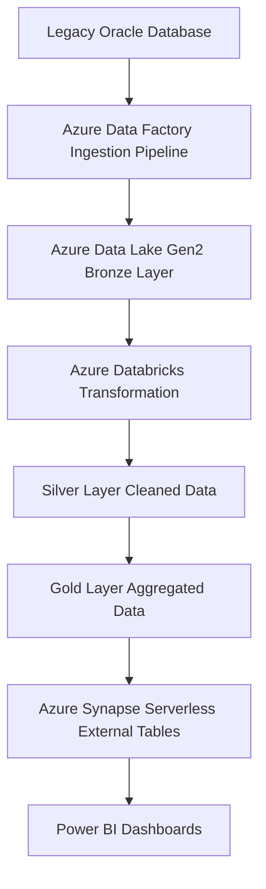
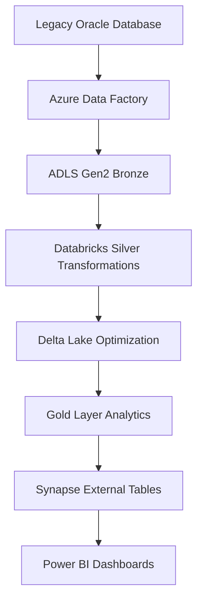

# Oracle to Azure Data Lake Gen2 Medallion Migration

## Overview

This project demonstrates a production-style **legacy data migration pipeline from Oracle to Azure Data Lake Gen2** using the **Medallion Architecture (Bronze → Silver → Gold)**.

The pipeline extracts data from a legacy Oracle database, processes it using **Azure Databricks and PySpark**, applies **data quality and deduplication logic**, and builds optimized analytical datasets for **Power BI reporting**.

This repository represents a **realistic enterprise data engineering workflow** including incremental loads, upserts, optimization techniques, and analytics-ready data models.

---

## Architecture Diagram



# Architecture

```
Legacy Oracle Database
        ↓
Azure Data Factory
(Extraction Pipeline)

        ↓
ADLS Gen2
Bronze Layer (Raw Data)

        ↓
Azure Databricks
Silver Layer (Data Cleaning + Transformations)

        ↓
Delta Lake Gold Layer
Business Aggregations

        ↓
Azure Synapse Serverless
External Tables + Views

        ↓
Power BI
Business Dashboards
```

---

# Medallion Architecture

## Bronze Layer

Raw ingestion of source data from Oracle.

Tables stored exactly as received from the source system.

Responsibilities:

• Oracle data extraction
• Schema preservation
• Raw historical storage

Example datasets:

```
sales
customers
products
```

---

## Silver Layer

The Silver layer performs **data transformation, enrichment, and quality checks**.

Key transformations include:

• Data validation and filtering
• Duplicate detection and removal
• Join operations across dimension tables
• Business enrichment logic
• Incremental processing
• Upsert (merge) logic

Example transformations:

```
sales + customers join
sales + products join
duplicate order removal
data quality validation
```

Silver layer also prepares datasets for downstream analytics.

---

## Gold Layer

The Gold layer contains **analytics-ready datasets**.

Business aggregations and ranking logic are implemented here.

Example analytics transformations:

```
Customer revenue aggregation
Order counts
Customer sales ranking
```

Example SQL:

```
SELECT
customer_id,
customer_name,
SUM(amount) AS total_sales,
COUNT(order_id) AS total_orders,
RANK() OVER (ORDER BY SUM(amount) DESC) AS sales_rank
FROM sales_enriched
GROUP BY customer_id, customer_name
```

---

# Incremental Data Processing

The pipeline implements **incremental loading** to process only new records.

Techniques used:

• Watermark filtering
• Delta merge logic
• Upsert operations

Example logic:

```
MERGE INTO silver_table
USING new_data
ON target.order_id = source.order_id
WHEN MATCHED THEN UPDATE
WHEN NOT MATCHED THEN INSERT
```

This prevents duplicate records and ensures data consistency.

---

# Data Quality Framework

The pipeline enforces multiple data quality rules:

• Order ID must not be null
• Customer ID must not be null
• Sales amount must be positive
• Duplicate orders must be removed
• Referential integrity between fact and dimension tables

These checks are implemented during the **Silver transformation layer**.

---

# Performance Optimization Techniques

This project demonstrates several **enterprise-grade performance optimization techniques** used in large-scale Spark pipelines.

### Spark Optimizations

• Broadcast joins for small dimension tables
• DataFrame caching for repeated transformations
• Repartitioning to improve parallel processing
• Adaptive Query Execution
• Skew join handling

Example:

```
sales_joined = deduplicated_sales
.join(broadcast(customers_df), "customer_id")
.join(broadcast(products_df), "product_id")
```

---

### Delta Lake Optimizations

• Partitioned data storage
• File compaction using OPTIMIZE
• Z-Order indexing for faster filtering
• VACUUM cleanup for old files

Example:

```
OPTIMIZE gold_customer_sales
ZORDER BY (customer_id)

VACUUM gold_customer_sales RETAIN 168 HOURS
```

---



# External Tables and Analytics Layer

Azure Synapse Serverless is used to expose curated datasets.

Example external table:

```
CREATE EXTERNAL TABLE ext_gold_customer_sales
WITH (
LOCATION = 'gold/customer_sales',
DATA_SOURCE = adls_source,
FILE_FORMAT = delta_format
)
```

Analytical view:

```
CREATE VIEW vw_top_customers AS
SELECT
customer_id,
customer_name,
total_sales
FROM ext_gold_customer_sales
WHERE sales_rank <= 10
```

---

# Power BI Integration

Power BI consumes the curated datasets through Synapse views.

Example dashboards:

• Top customers by revenue
• Sales trends over time
• Customer segmentation
• Product performance

---

# Repository Structure

```
oracle-to-adls-medallion-migration

architecture/
bronze/
silver/
gold/
optimization/
warehouse/
incremental/
powerbi/
data_quality/
monitoring/
cicd/
README.md
```

---

# Enterprise Features Demonstrated

This project showcases several enterprise data engineering capabilities:

• Legacy Oracle to cloud migration
• Medallion architecture implementation
• Incremental ETL pipelines
• Delta Lake performance tuning
• Complex Spark transformations
• Data quality validation framework
• CI/CD pipeline design
• Monitoring and logging framework
• Power BI analytics integration

---

# Technologies Used

Azure Data Factory
Azure Data Lake Gen2
Azure Databricks
PySpark
Delta Lake
Azure Synapse Serverless
Power BI

---

# Author

**Kunal Krishnan**

Data Engineer
Azure | Databricks | PySpark | Data Engineering

Consultant at Capgemini
Formerly at Infosys

---
